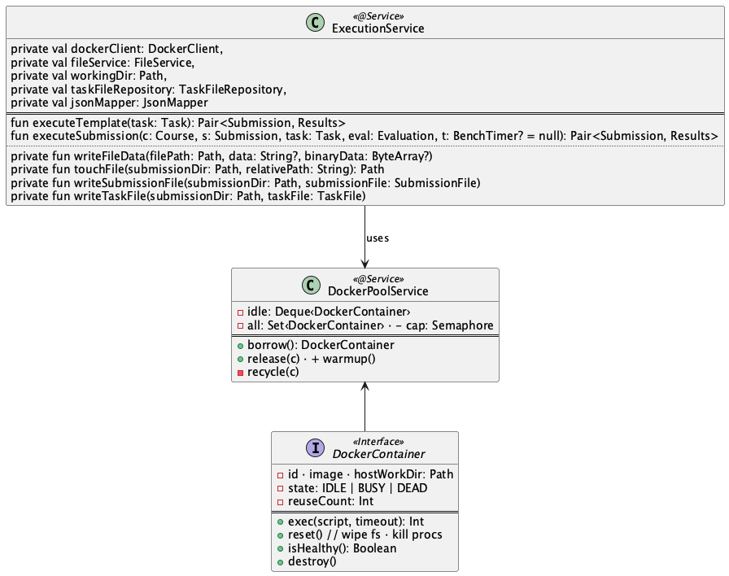
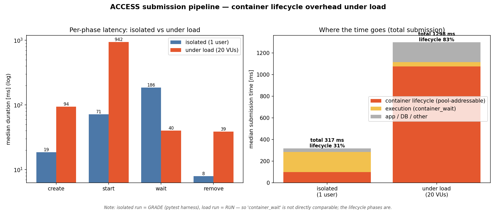
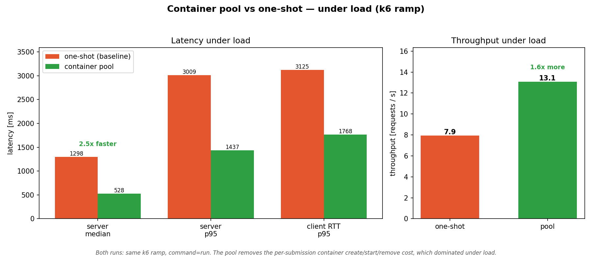
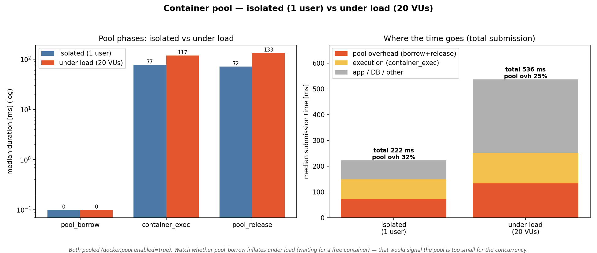

# Start the engine:

```bash
JAVA_HOME=$(/usr/libexec/java_home -v 21) API_KEY=1234 WORKING_DIR="$HOME/Documents/UZH/Master/master_project/access/data" AUTH_SERVER_URL=http://localhost:8080 ./gradlew bootRun
```

With pools:
```bash
DOCKER_POOL_ENABLED=true DOCKER_POOL_IMAGE=python:latest JAVA_HOME=$(/usr/libexec/java_home -v 21) API_KEY=1234 WORKING_DIR="$HOME/Documents/UZH/Master/master_project/access/data" AUTH_SERVER_URL=http://localhost:8080 ./gradlew bootRun
```

## Docker Engine update

To add the feature of Docker pools for faster loading and preparation speeds. We added the following classes:



There are now additional files found here: ```src/main/kotlin/ch.uzh.ifi.access/service```
- DockerContainer.kt
- DockerContainerInstance.kt
- DockerPoolService

### Performance increase for peak loads

When we compare a performance test to the regular running performance for an individual container, we realize that there is a severe bottle neck.


Comparing isolated vs load

Now after the implementation of the pooled containers we have the following:


Performance differences in pooled approach vs individual container launch.

And if we get the diagram from the beginning we get substantially different results. Suggesting that the pooled approach is indeed the faster approach.


Comparing isolated vs load
